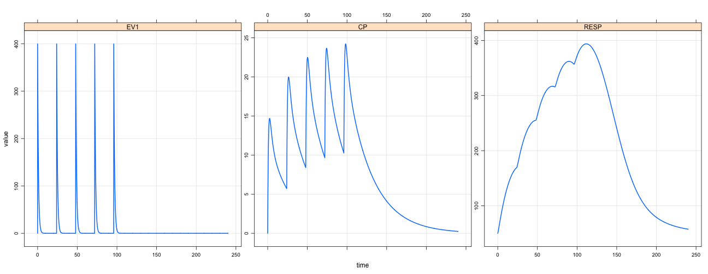
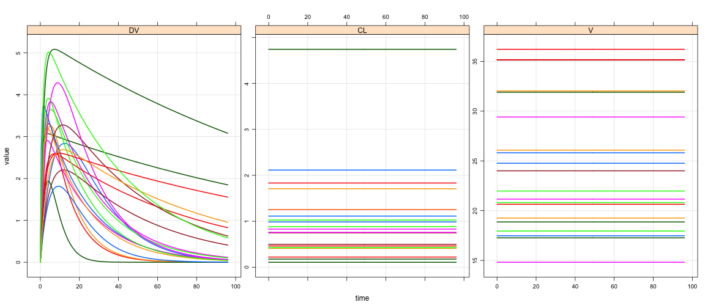

Developing Interactive Visualization Tools for Model-Supported R&D
========================================================
author: Metrum Research Group 
date:  18 March, 2017 Washington, DC
autosize: true
width: 1640
height: 900


Outline
===========

- Where we're heading: moxifloxacin PK dashboard app 

- Some `mrgsolve`

- Some `Shiny`

- Create a simple app to explore the moxi model

- Review the moxi dashboard app

- Deploy the moxi app on Metworx Envision

- Look at other apps for clinical decision-making

- Metworx Envison hands-on


Moxifloxacin dashboard app
==================================
- https://metrumrg.shinyapps.io/moxi
- [Moxifloxacin PK in diabetic foot infection](http://repository.ddmore.eu/model/DDMODEL00000034)
- Proposed dose: 400 mg IV Q24h


Decision questions
==================================
- Under the proposed dose, what is the highest MIC we can expect to cover?
   - __M__inimum __I__nhibitory __C__oncentration
   - Gram positive bacteria
   - Gram negative bacteria
- What is the expected efficacy?
  - AUC/MIC ratio
      - After first dose
      - After third dose
- How does patient body size affect expected efficacy?
  - Weight / BMI


To answer these questions, we need ...
============================================
- Moxifloxacin population PK model
  - Day 1 and day 3 AUC
  - Loading and maintenance doses
  - Fraction unbound
- Simulate populations
  - Different body-size distribution
- Summaries by several factors
  - Bacteria type
  - MIC
  
A dashboard gives access to decision makers
==========================================
- Real-time updates based on decision-maker input
- Let decision makers
  - interact with the model
  - explore the scenarios of their choosing
  - answer questions as the discussion develops
- Does not require any technical skill or modeling background


What we need for the dashboard
========================================
- Moxifloxacin PK model in agile format
  - Needs to be quick
  - Clean implementation
  - Accessible / portable
- User interface
  - Allow user input
  - Display simulation results
  - Easy to understand / navigate
- Some code that turns user input into desired results


mrgsolve in brief
=======================


```r
library(mrgsolve)
mod <- mread_cache("irm2", modlib())
```


```r
mod
```

```


-------- mrgsolve model object (unix) --------
  Project: /Users/kyleb/Rlibs/lib/mrgsolve/models
  source:        irm2.cpp
  shared object: irm2-so-9f7815bdec21 

  compile date:  
  Time:          start: 0 end: 24 delta: 1
  >              add: <none>
  >              tscale: 1

  Compartments:  EV1 CENT PERIPH RESP EV2 [5]
  Parameters:    CL VC Q VP KA1 KA2
  >              KIN KOUT IC50 IMAX n VMAX
  >              KM [13]
  Omega:         0x0 
  Sigma:         0x0 

  Solver:        atol: 1e-08 rtol: 1e-08
  >              maxsteps: 2000 hmin: 0 hmax: 0
```

Simulate a dosing regimen
===============

```r
out <- 
  mod %>% 
  param(KOUT=0.2,IC50=2) %>%
  ev(amt=400,ii=24, addl=4) %>% 
  mrgsim(end=240, delta=0.1)
```


```r
plot(out,EV1+CP+RESP~.)
```




Population simulation
===============

```r
mod <- mread("popex", modlib())
```


```r
mod %>% ev(amt=100) %>% mrgsim(end=96,nid=20) %>% plot(DV+CL+V~.)
```



Get started with mrgsolve
==============================
- [mrgsolve.github.io](https://mrgsolve.github.io)


Moxifloxacin model
=======================
- Let's do side-by-side conversion from NONMEM control stream
- Model downloaded from DDMoRe model repository
  - http://repository.ddmore.eu/model/DDMODEL00000034
- First, do a one-to-one conversion
  - Model amounts computed in closed form (like ADVAN2/ADVAN4)
- Then, code an ODE-based version
  - This let's us get the day 1 and 3 `AUC` values we need for the dashboard


$PROBLEM
=============

NONMEM

```r
;; 1. Based on: run021
;; 2. Description: PK of moxifloxacin in patients with diabetic foot infections
;; x1. Author: Sebastian G. Wicha, Freie Universitaet Berlin, Germany
;; 3. Label:
$PROBLEM PK
```

***

mrgsolve

```r
$PROB
# Wicha et al. 2015
- Moxifloxacin PK in diabetic foot infection
- Author: Sebastian G. Wicha, Freie Universitaet Berlin, Germany
- https://www.ncbi.nlm.nih.gov/pubmed/25600294
```

$INPUT
=======
NONMEM

```r
$INPUT ID TIME DV AMT RATE MDV EVID CMT WGT IBW 
```

***

mrgsolve

```r
$PARAM WGT = 70, IBW = 70, fu = 0.6
```


$DATA
=======


NONMEM

```r
$DATA MOX02_sim.csv ; IGNORE=#
```
***
mrgsolve

```r
## Not required
```

- `mrgsolve` will work with your NONMEM data set
- Pass in as `R` data frame


$SUBROUTINES
=======


NONMEM

```r
$SUBROUTINES ADVAN3 TRANS4
```

***

mrgsolve

```r
$PKMODEL cmt="CENT PERIPH"
```

$PK
=======


NONMEM

```r
$PK
TVCL  = THETA(1) 
ASCCL = TVCL * (IBW/70)**0.75
CL    = ASCCL * EXP(ETA(1))

TVV1  = THETA(2) 
ASCV1 = TVV1 * (WGT/70)**1
V1    = ASCV1 * EXP(ETA(2))

Q  = THETA(3) 

TVV2 = THETA(4)
ASCV2 = TVV2 * (WGT/70)**1
V2    = ASCV2 

S1 = V1
```

***
mrgsolve

```r
$MAIN
double TVCL  = THETA1;
double ASCCL = TVCL*pow(IBW/70,0.75);
double CL    = ASCCL*exp(ETA(1));

double TVV1  = THETA2;
double ASCV1 = TVV1*WGT/70.0;
double V1    = ASCV1*exp(ETA(2));

double Q = THETA3;

double TVV2  = THETA4;
double ASCV2 = TVV2*WGT/70.0;
double V2    = ASCV2;
```


$ERROR
=======


NONMEM

```r
IPRED = F
DEL   = 0
IF (IPRED.EQ.0) DEL=0.0001
W     = F
Y     = F+F*EPS(1)+EPS(2)
IRES  = DV-IPRED
IWRES = IRES/(W+DEL)
```

***
mrgsolve

```r
$TABLE
capture IPRED = CENT/V1;
double  DV = IPRED*(1+EPS(1)) + EPS(2);

capture fIPRED = fu*IPRED;
capture fDV = fu*DV;

$CAPTURE DV
```


$THETA, $OMEGA, $SIGMA
=======


NONMEM

```r
$THETA
1.21E+01 ; CL
6.81E+01 ; V1
2.03E+01 ; Q
4.46E+01 ; V2

$OMEGA
6.33E-02        ; CL
7.25E-02        ; V1

$SIGMA
3.40E-02 ; Prop 
4.65E-03 ; Add
```

***
mrgsolve

```r
$THETA
1.21E+01
6.81E+01
2.03E+01
4.46E+01

$OMEGA
6.33E-02
7.25E-02

$SIGMA
3.40E-02
4.65E-03
```

No equivalent
=======


NONMEM

```r
$EST METHOD=1 INTER MAXEVAL=0 NOABORT SIG=3 PRINT=1 POSTHOC
;$COV
```

***
mrgsolve

```r
$SET delta=0.1, end=24*3
```

- Easy to simulate at the times you want observations
- `mrgsolve` itself doesn't not generate estimates; but
it may be used as a part of optimization process in `R`

Let's expand the mrgsolve model
========
- Differential equations
- Calculate AUC0-24 and AUC48-72


Develop R code for moxi sims
===============================
- Need cohort with 1000 patients
- Covariates
  - Weight, height,SEX (IBW,BMI)
- Dosing
  - 400 mg IV Q24h
  - Option for loading dose (hypothetical)
- Simulate out to day 3

Introduce dmutate package
=========
- [https://cran.r-project.org/package=dmutate](https://cran.r-project.org/package=dmutate)
- Quickly simulate variates
   - any distribution at any level 
   - bounds 
- Specified as formula
- Collect in sets

dmutate example
=====================

```r
library(dmutate)
muwt <- 90
sdwt <- 90
pfe <- 0.65
```


```r
cov1 <- covset(WT[40,140] ~ rnorm(muwt,sdwt)|ID,
               SEX ~ rbinomial(pfe)|ID)
```

```r
cov1
```

```
 Formulae                              
   WT[40, 140] ~ rnorm(muwt, sdwt) | ID
   SEX ~ rbinomial(pfe) | ID           
```

========

```r
set.seed(1133)
data_frame(ID=1:25) %>% mutate_random(cov1)
```

```
# A tibble: 25 × 3
      ID        WT   SEX
   <int>     <dbl> <dbl>
 1     1  72.70968     0
 2     2 113.04180     0
 3     3  48.01491     0
 4     4 136.14602     1
 5     5  45.96462     0
 6     6  49.44370     0
 7     7  53.01213     0
 8     8  58.69607     1
 9     9  90.22743     1
10    10  42.13365     0
# ... with 15 more rows
```

=======

```r
data(exTheoph)

exTheoph %<>% mutate_random(cov1)
```


```
  ID Dose time  conc cmt  amt evid       WT SEX
1  1 4.02 0.00  0.00   1 4.02    1 104.4561   1
2  1 4.02 0.25  2.84   0 0.00    0 104.4561   1
3  1 4.02 0.57  6.57   0 0.00    0 104.4561   1
4  1 4.02 1.12 10.50   0 0.00    0 104.4561   1
5  1 4.02 2.02  9.66   0 0.00    0 104.4561   1
6  1 4.02 3.82  8.58   0 0.00    0 104.4561   1
```

```
# A tibble: 12 × 9
      ID  Dose  time  conc   cmt   amt  evid        WT   SEX
   <dbl> <dbl> <dbl> <dbl> <dbl> <dbl> <dbl>     <dbl> <dbl>
 1     1  4.02     0     0     1  4.02     1 104.45610     1
 2     2  4.40     0     0     1  4.40     1 114.81208     1
 3     3  4.53     0     0     1  4.53     1 101.61445     1
 4     4  4.40     0     0     1  4.40     1  49.35125     0
 5     5  5.86     0     0     1  5.86     1  87.70382     0
 6     6  4.00     0     0     1  4.00     1  68.31451     0
 7     7  4.95     0     0     1  4.95     1  59.86039     1
 8     8  4.53     0     0     1  4.53     1 119.72622     1
 9     9  3.10     0     0     1  3.10     1 134.69793     1
10    10  5.50     0     0     1  5.50     1 133.01366     0
11    11  4.92     0     0     1  4.92     1  49.43897     1
12    12  5.30     0     0     1  5.30     1 109.66744     1
```


Shiny
====================
- A huge topic; we will just scratch the surface
- Developed by Rstudio + lots of contributors
- The place to start: http://shiny.rstudio.com/
  - Tutorials, galleries, articles, example code


Elements of Shiny
====================
- Two main elements to shiny app
  - User interface (UI, `ui.R`)
  - Server (`server.R`)
- User interface
  - Data input (widgets: text, numeric, select, checkbox)
  - Layout (fluidPage, tabSet)
  - Return data 
- Server
  - All computations
  - Generate outputs to be displayed in UI
  - Largely plain old `R` code written in server environment
- Reactivity

Explore Shiny with a flexdashboard
====================================
- Interactive Rmarkdown document
  - Define some inputs 
  - Return some outputs
- flexdashboard puts it all together for you
  - Widgets (input)
  - Render (output)
  - Reactivity
  - Control reactivity with action button


Recommend shinydashboard as environment for your app
===============================
- https://rstudio.github.io/shinydashboard/
- Similar concept to flexdashboard
- Menu bar on the left
  - Add submenus
- Main app space on the right
  - Arrange with boxes
  - Add tabsets


Let's take a look at the Moxifloxacin code
============================================
- `./moxi2/ui.R` and `./moxi2/server.R`


